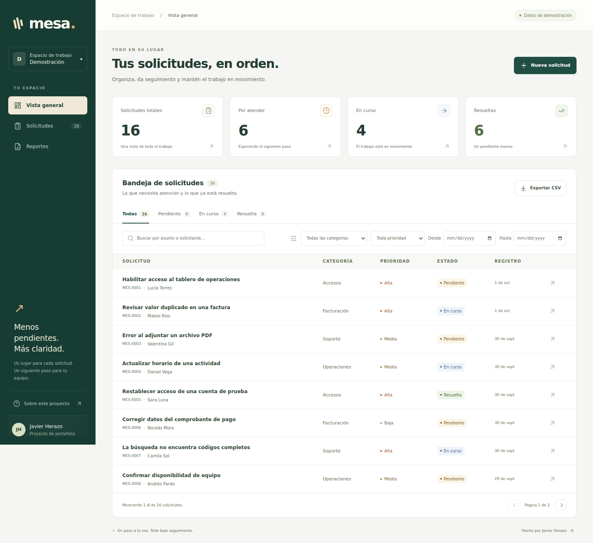
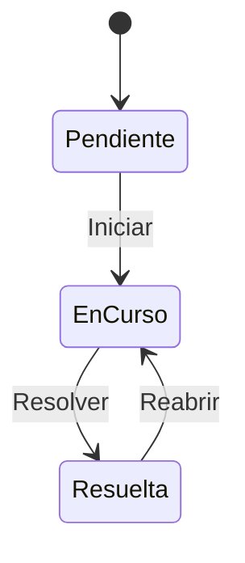
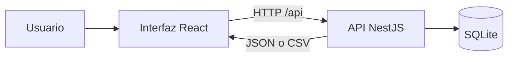

# Mesa

**Seguimiento de solicitudes internas con React y NestJS.**

[Abrir demo](https://mesa-solicitudes.onrender.com) · [Ver código](https://github.com/JavierHerazoR/mesa-solicitudes)

Mesa reúne solicitudes de soporte, accesos, facturación y operaciones en una bandeja. Permite registrar una solicitud, consultar su detalle, avanzar su estado, revisar su historial y exportar los resultados de una búsqueda. Su propósito es mostrar un flujo full stack completo y fácil de entender.

Es un proyecto personal de portafolio preparado con asistencia de IA. Los datos son ficticios, la aplicación no representa un sistema de un empleador ni un trabajo laboral anterior. El código está publicado en [GitHub](https://github.com/JavierHerazoR/mesa-solicitudes). La demo pública está disponible, también puedes ejecutar la aplicación localmente siguiendo las instrucciones de este README.



[Ver detalle e historial](docs/screenshots/detail.png) · [Ver interfaz móvil](docs/screenshots/mobile.png)

## Qué se puede probar

- Crear solicitudes con título, descripción, solicitante, categoría y prioridad.
- Buscar y combinar filtros, incluido un rango de fechas de creación; navegar por páginas de resultados.
- Consultar indicadores globales, independientes de los filtros de la bandeja.
- Cambiar de estado con reglas validadas por la API y conservar un historial.
- Reabrir solicitudes resueltas para continuar su atención.
- Descargar en CSV **todos** los resultados que cumplen los filtros, aunque ocupen varias páginas.
- Reiniciar el servidor y conservar las solicitudes en SQLite.

El flujo de estados es:



## Ejecutar en local

Requisitos: **Node.js 24 o superior y npm 11 o superior**. Ejecuta los comandos desde esta carpeta (`mesa`). La instalación inicial descarga dependencias; después, la demo funciona localmente sin conectarse a servicios externos.

```bash
npm ci
npm run dev
```

Abre [http://localhost:5173](http://localhost:5173). El comando inicia el frontend con Vite y la API en `http://localhost:4010/api`. Mantén la terminal abierta; usa `Ctrl+C` para detenerlos.

La base de datos se crea automáticamente en `data/mesa.sqlite` con solicitudes de ejemplo. Los siguientes inicios conservan los datos. `DATABASE_PATH` permite elegir otro archivo; por ejemplo, en una terminal de Linux o macOS:

```bash
DATABASE_PATH=./data/mesa-pruebas.sqlite npm run dev
```

Para ejecutar la versión compilada:

```bash
npm run build
npm start
```

Abre [http://localhost:4010](http://localhost:4010). La API sirve también los archivos compilados del frontend.

El archivo `.env.example` documenta `HOST`, `PORT` y `DATABASE_PATH`. La API usa sus valores predeterminados y **no carga `.env` automáticamente**. Para aplicar un archivo de configuración a la versión compilada:

```bash
cp .env.example .env
node --env-file=.env dist/server/main.js
```

Vite sí lee `.env` durante el desarrollo y la compilación del frontend. `VITE_PUBLIC_DEMO=true` añade un aviso de datos compartidos y temporales; cambiar esta variable requiere recompilar la interfaz. No modifica la persistencia de SQLite.

## Desplegar tu propia copia en Render Free

El archivo [render.yaml](render.yaml) prepara un único servicio gratuito: NestJS sirve la API y la interfaz React compilada. La base de datos de esta modalidad es temporal. Render puede suspender el servicio por inactividad y los datos locales se pierden al reiniciar o volver a desplegar. Consulta las [condiciones del plan gratuito](https://render.com/docs/free).

[Crear una copia de Mesa en Render](https://render.com/deploy?repo=https%3A%2F%2Fgithub.com%2FJavierHerazoR%2Fmesa-solicitudes)

Abre el enlace anterior desde tu cuenta de Render, revisa que el servicio tenga el plan **Free** y sigue la [guía de despliegue](docs/despliegue.md). Esta configuración no crea recursos hasta completar el proceso en Render. Este enlace abre el formulario para crear otra instancia de Mesa en tu cuenta.

## Verificar el proyecto

```bash
npm run typecheck
npm test
npm run build
npm run format:check
```

Las pruebas automatizadas de la API usan `node:test` y Supertest. Cubren validación, filtros, transiciones, historial, CSV y persistencia. Para ejecutar también los cuatro escenarios de navegador con Playwright:

```bash
npx playwright install chromium
npm run test:e2e
```

En Linux, si faltan bibliotecas del navegador, instalar sus dependencias con `npx playwright install-deps chromium`; este paso puede requerir permisos de administrador. `npm run test:e2e` compila el proyecto y levanta automáticamente una instancia de prueba en el puerto 4011. No necesita que `npm run dev` esté en ejecución.

La suite de navegador recorre la bandeja y exportación, el ciclo completo de una solicitud, la recuperación de errores y la navegación móvil. La [matriz de QA](docs/qa.md) distingue esos escenarios automatizados de las verificaciones manuales pendientes.

Verificado el **1 de octubre de 2026**, con Node.js **24.18.0** y npm **11.16.0**: compilación correcta, **9/9 pruebas de API** y **4/4 escenarios de Playwright en Chromium** aprobados. Las capturas anteriores proceden de esa ejecución.

El formato del código y la documentación se mantiene con Prettier 3.6.2: `npm run format:check` revisa y `npm run format` aplica el formato.

## Cómo está construido

| Capa         | Tecnología                                  | Responsabilidad                                                    |
| ------------ | ------------------------------------------- | ------------------------------------------------------------------ |
| Interfaz     | React 19, TypeScript y Vite 7               | Formularios, bandeja, filtros, detalle y estados de carga/error    |
| API          | NestJS 11 y TypeScript                      | Validación, reglas de transición y endpoints HTTP                  |
| Persistencia | SQLite mediante `node:sqlite` de Node.js 24 | Solicitudes e historial en un archivo local                        |
| Verificación | `node:test`, Supertest y Playwright         | Ejercitar la API mediante HTTP y los flujos de usuario en Chromium |



La validación vive en la API para que también se aplique cuando la petición no proviene del formulario. NestJS dispone de [ValidationPipe para validar los DTO](https://docs.nestjs.com/techniques/validation). SQLite evita instalar un servidor de base de datos para probar la demo; puedes consultar la [documentación oficial de `node:sqlite`](https://nodejs.org/docs/latest-v24.x/api/sqlite.html). El frontend utiliza el flujo de desarrollo y compilación de la [guía oficial de Vite](https://vite.dev/guide/).

## Alcance y límites

Mesa es una aplicación de demostración con un único entorno de trabajo. Incluye creación, consulta y cambios de estado; no incluye edición del texto de una solicitud, eliminación, autenticación, roles, asignación a agentes, adjuntos ni notificaciones. El historial registra cambios de estado, sin identificar a una persona autenticada.

La implementación sirve para estudiar integración, reglas de negocio, persistencia y QA. Una versión para varios usuarios necesitaría primero identidad, permisos y una estrategia de concurrencia y operación acordes con ese uso.

## Documentación

- [API y ejemplos de uso](docs/api.md).
- [Casos de QA manual y registro de resultados](docs/qa.md).
- [Guion para presentar el proyecto y decisiones técnicas](docs/entrevista.md).
- [Repositorio publicado y próximos pasos](docs/publicacion.md).
- [Despliegue gratuito en Render](docs/despliegue.md).

## Perfil

Javier Herazo — perfil de desarrollador full stack junior.

[GitHub](https://github.com/JavierHerazoR) · [LinkedIn](https://www.linkedin.com/in/javier-herazo-53a26b186/)
